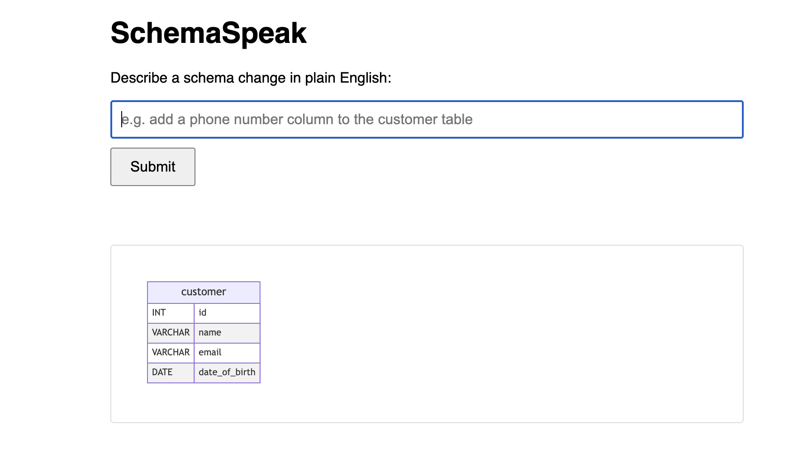

# SchemaSpeak

Describe a database schema change in plain English. SchemaSpeak interprets it with an LLM, validates it against a safety whitelist, applies it to a real MySQL database, and renders a live ER diagram — regenerated directly from the database's actual structure every time.

# Demo
**Live demo:** http://schemaspeak-env.eba-wzfdnkun.ap-southeast-2.elasticbeanstalk.com


## How it works

The core idea: the diagram is never based on "what we think we did" — it's rebuilt from the database's real, current structure on every request. If a sentence doesn't produce a valid, safe schema change, nothing is executed, and the diagram simply doesn't move. This makes the visual output an inherent proof of correctness rather than something that needs separate validation logic to display.

**Pipeline:**
1. **Interpretation** — the sentence is sent to Google's Gemini API with the current schema as context, and translated into a proposed SQL DDL statement (or `NONE` if the sentence doesn't describe a valid schema change).
2. **Validation** — the proposed statement is checked against a safety whitelist (only `ALTER TABLE` / `CREATE TABLE` allowed; destructive operations like `DROP`, `DELETE`, `INSERT` are blocked outright).
3. **Execution** — validated statements are run against the live database inside a transaction, so nothing partially applies.
4. **Introspection** — regardless of whether execution happened, the app re-reads the database's actual current structure via JDBC metadata.
5. **Rendering** — the structure is converted to Mermaid.js `erDiagram` syntax and rendered live in the browser.

## Tech stack

- **Backend:** Java, Spring Boot, Spring Data JPA
- **Database:** MySQL (Amazon RDS)
- **LLM:** Google Gemini API (Interactions API)
- **Frontend:** Plain HTML/JS with Mermaid.js for diagram rendering
- **Cloud infrastructure:** AWS Elastic Beanstalk (application hosting), Amazon RDS (managed MySQL), VPC networking, IAM, Security Groups

## Running locally

1. Clone the repo and set environment variables:
```bash
   export GEMINI_API_KEY=your_gemini_api_key
   export RDS_PASSWORD=your_database_password
```
2. Build and run:
```bash
   ./mvnw clean package -DskipTests
   ./mvnw spring-boot:run
```
3. Open `frontend/index.html` in a browser (or serve it locally with `python3 -m http.server 3000` from the `frontend/` directory).

## Architecture notes

- Validation happens *before* execution — nothing touches the database until a statement passes the safety whitelist.
- Execution is wrapped in a transaction, so a failed statement can't leave the schema in a partially-modified state.
- Introspection always runs after every request, independent of whether execution occurred, which is what guarantees the diagram accurately reflects reality rather than an assumed outcome.
